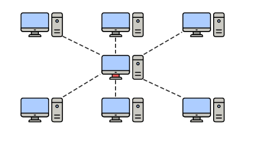

### 1. ¿Qué es Internet? ¿Qué es la Web?

- **Internet:** Conjunto masivo de redes interconectadas globalmente, permitiendo la comunicación y el intercambio de datos entre dispositivos.
- **World Wide Web (WWW o "la Web"):** Es un servicio que corre sobre Internet. Se refiere a los sitios web (documentos HTML, imágenes, etc.) interconectados mediante hipervínculos y accesibles a través de navegadores y servidores web.

### 2. ¿Qué es una red?

- Un sistema de dispositivos (ordenadores, servidores, móviles, etc.) interconectados que comparten recursos o datos.

**Tipos comunes de redes:**


| Tipo | Descripción                                               | Relevancia en Auditorías                                                       |
| :--- | :--------------------------------------------------------- | :------------------------------------------------------------------------------ |
| LAN  | Local Area Network. Red pequeña (casa, oficina pequeña). | Objetivo tras acceso inicial (pivotar, descubrimiento de más equipos).         |
| WLAN | Wireless LAN. LAN basada en Wi-Fi.                         | Vector de entrada común (ataques WPA/WPA2/WPA3, portales cautivos, Rogue APs). |
| WAN  | Wide Area Network. Redes de mayor escala interconectadas.  | Comprender exposición de una organización en Internet.                        |

### 3. Topología de red

- **Topología estrella:** Dispositivos conectados a un nodo central (switch o router).

  
- El **router** actúa como `gateway` que conecta la red local al ISP.

**Punto Clave (Ofensiva):**

```bash
# Escaneo de red interna
nmap -sn 192.168.1.0/24
```

Permite descubrir dispositivos activos, servicios y vulnerabilidades potenciales (movimiento lateral).

### 4. ¿Qué es una Dirección IP?

- Identificador numérico único para dispositivos en una red.

**Versiones:**

- **IPv4:** `192.168.1.10`
- **IPv6:** `2001:0db8:85a3:0000:0000:8a2e:0370:7334`

**IP privada vs pública:**


| Tipo     | Uso                           | Rango Común (IPv4)                             |
| :------- | :---------------------------- | :---------------------------------------------- |
| Privada  | Redes locales (no enrutable). | `10.0.0.0/8`, `172.16.0.0/12`, `192.168.0.0/16` |
| Pública | Acceso global en Internet.    | Cualquier otra dirección no reservada          |

### 5. Protocolos clave en redes locales

#### ARP (Address Resolution Protocol)

Mapea direcciones IP a MAC en redes locales.

**Ataques comunes:**

- **ARP Spoofing / Poisoning:** Redirección del tráfico para Man-in-the-Middle (MitM).

**Herramientas:**

- `arpspoof`
- `ettercap`
- `bettercap`

#### DHCP (Dynamic Host Configuration Protocol)

Asignación automática de IPs y parámetros de red.

**Ataques comunes:**

- **DHCP Spoofing:** Servidor DHCP falso para redirigir tráfico.
- **DHCP Starvation:** Agotar el pool de IPs disponibles provocando denegación de servicio.
